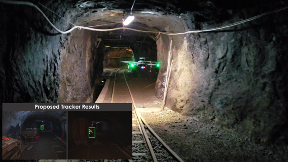
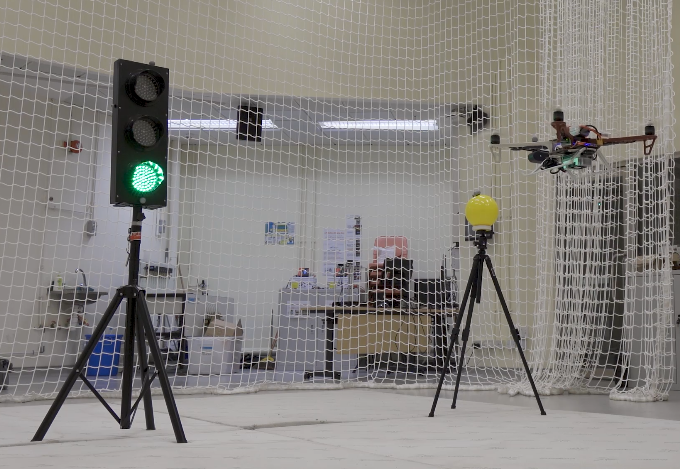
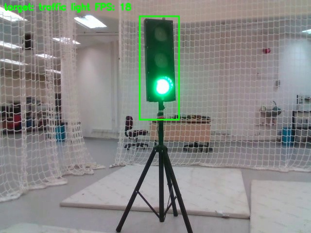

### This is the Matlab and Pytorch demo code for the paper "Online Recommendation-based Convolutional Features for Scale-Aware Visual Tracking"

[](https://youtu.be/peLZow-4aUM)

### For Matlab version

Folder list:

/data: contain one benchmark dataset (Human5). (For more datasets, please download from http://cvlab.hanyang.ac.kr/tracker_benchmark/datasets.html)

/external: matconvnet (please setup the compiler for mex files)

/functions: matlab functions for visual tracking

/model: please download the VGG-19 net here
(Download the VGG-Net-19 using the link https://uofi.box.com/shared/static/kxzjhbagd6ih1rf7mjyoxn2hy70hltpl.mat
If you are in China, please use this link: http://pan.baidu.com/s/1kU1Me5T )

Run the main entry file demo.m to see the tracking results


### For Pytorch version

### PS: I forgot to remove the letterbox from yolo featuremap, which caused the coordinate drifts in the demo results. I am sorry for the user who tried the demo and find the results might be frastrating.

Make sure you have successfully installed the pytorch on your ubuntu,

run the following script to install all necessary packages:

````
./install.sh
````

video_demo.py: plot cnn features output for algorithm demonstration
UAV_tracking_demo.py: you are free to modify yaml file for other test

Run demo scripts:
````
python3 video_demo.py
````


````
python3 UAV_tracking_demo.py
````




### If you are using TX2, maybe it is better flash the jetpack 4.3 or lower version because 4.4 and 4.5 disabled the Denver cores

we provide a script for installing the requirements (Jetpack 4.2):

````
./install_for_tx2.sh
````

PS: I would suggest to do apt update and upgrade before running the script.

### If you just want to test the algorithm in simulation:


Please install our Gazebo simulation tool from: https://github.com/rduan036/E2ES.git

Make sure you can run Python3 on ROS workspace:
````
sudo apt-get install python3-catkin-pkg-modules
sudo apt-get install python3-rospkg-modules
````
Initial your workspace with python3: http://wiki.ros.org/catkin/Tutorials/create_a_workspace
key step:
````
catkin_make -DPYTHON_EXECUTABLE=/usr/bin/python3
````

Solving cv_bridge problem for Python3.6:
````
sudo apt-get install python-catkin-tools python3-dev python3-catkin-pkg-modules python3-numpy python3-yaml ros-melodic-cv-bridge
roscd
cd ..
catkin config -DPYTHON_EXECUTABLE=/usr/bin/python3 -DPYTHON_INCLUDE_DIR=/usr/include/python3.6m -DPYTHON_LIBRARY=/usr/lib/x86_64-linux-gnu/libpython3.6m.so
catkin config --install
git clone https://github.com/ros-perception/vision_opencv.git src/vision_opencv
apt-cache show ros-melodic-cv-bridge | grep Version
cd src/vision_opencv/
git checkout 1.13.0
gedit CMakeLists.txt

````
Please check if you are using correct python version:
````
find_package(Boost REQUIRED python3)
````
Then you can use catkin_make or catin build


Run tracker in Gazebo simulation (please download this repo to your workspace):
````
python3 gazebo_sim.py
````

If you want to run tracking with VO togather, you can try our VO project: https://github.com/arclab-hku/SOPVO

Demo (VO + tracking): 


### Contact:
Ran Duan: 	rduan036@gmail.com
